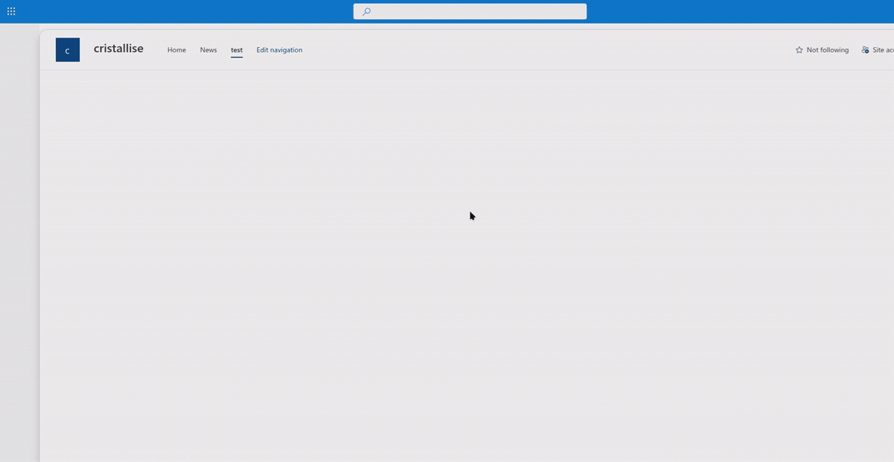
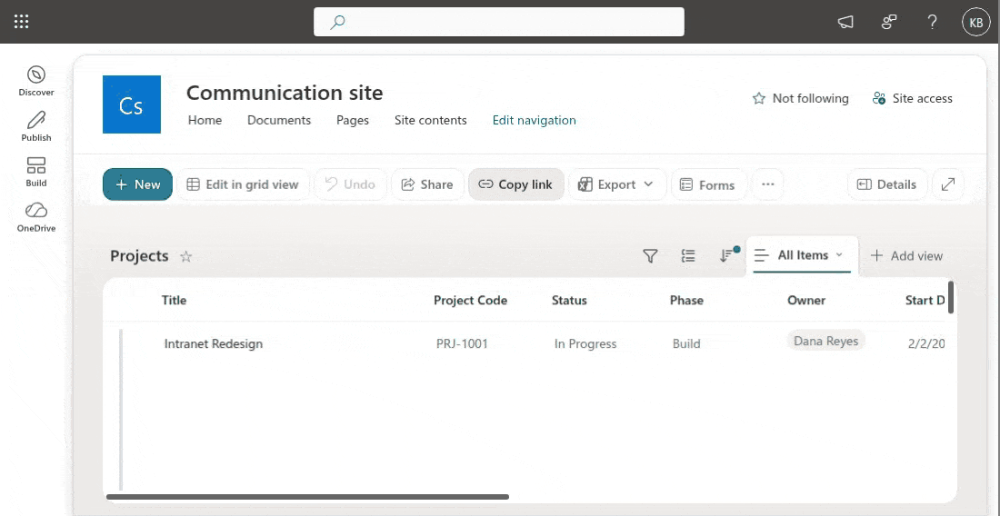
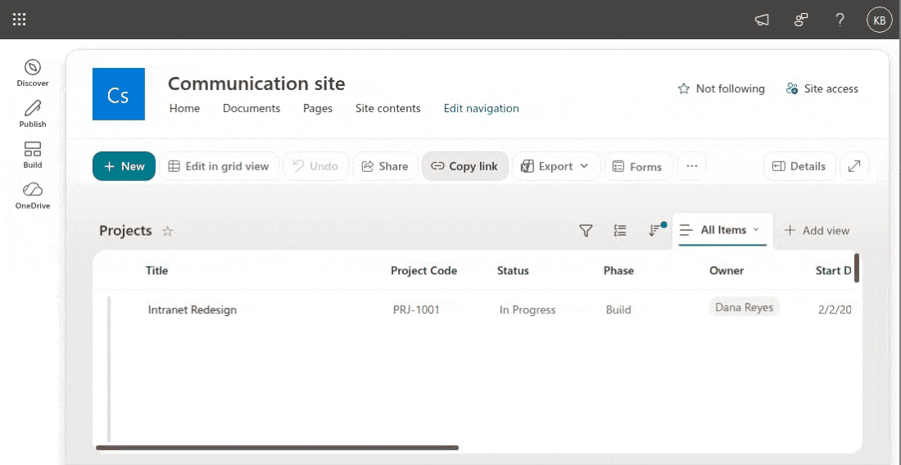
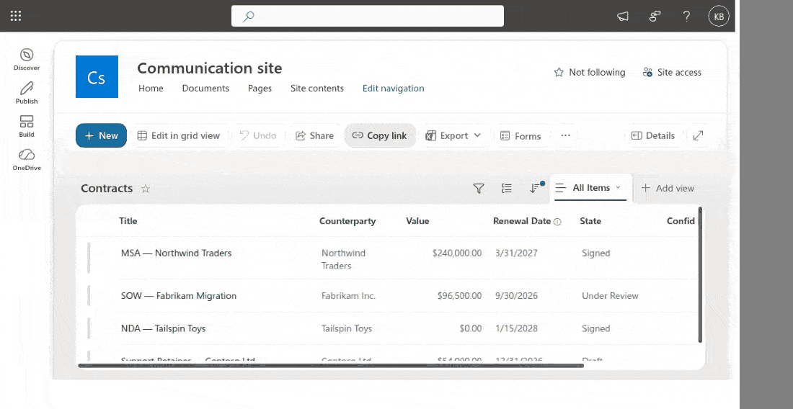

# DevTools for SharePoint

A Chrome/Edge extension for SharePoint Online. Navigate anywhere with a keystroke, and read the
metadata SharePoint's UI hides — internal column names, list GUIDs, content types and permission
assignments — without opening a settings page or a PowerShell console.

Built for developers, admins and power users who spend their day in SharePoint and know exactly
where they want to go.



<sub><b>Column Inspector (`Alt+C`)</b> — internal names, types and GUIDs for every column. Clicking
<b>Edit Column</b> lands directly on that column's settings page, which otherwise takes four or five
clicks to reach.</sub>

## Features

### Navigation

- **QuickNav (`Ctrl+K` or `Alt+N`)** — fuzzy search across 75+ built-in SharePoint destinations:
  settings pages, admin surfaces, recycle bins, term store, app catalog and more
- **Lists & Libraries (`Alt+O`)** — browse every list and library in the current site
- **Context-aware** — list-scoped destinations appear only when you are actually inside a list or
  library, so results stay short
- **Custom links** — add your own destinations on the options page, with the same placeholders the
  built-in ones use; they appear in QuickNav alongside them
- **Multi-cloud** — commercial and GCC (`*.sharepoint.com`), GCC High (`*.sharepoint.us`), DoD
  (`*.sharepoint-mil.us`) and China/21Vianet (`*.sharepoint.cn`). Only the commercial cloud has been
  tested against a live tenant; the others are wired up but unverified.



<sub><b>QuickNav (`Ctrl+K`)</b> — type to filter every built-in destination, <b>Enter</b> to go.
Results are scoped to where you already are, so a list page offers list settings and a site page
does not.</sub>



<sub><b>Lists &amp; Libraries (`Alt+O`)</b> — every list and library in the site with its item count,
filtered as you type. <b>Enter</b> opens the one you picked.</sub>

### Inspectors

- **Column Inspector (`Alt+C`)** — internal names, field types, GUIDs, calculated-column formulas,
  lookup relationships, and the current item's value for each column
- **Object Inspector (`Alt+I`)** — site, web, list, field and content-type metadata
- **Permission Inspector (`Alt+P`)** — role assignments, SharePoint groups with expandable
  membership, and permission-level definitions
- **Deep links out** — jump straight from a column to its settings page, or from the permissions
  panel to site permissions, skipping the four or five clicks SharePoint normally needs
- **Copy-to-clipboard** on every GUID, internal name and field value



<sub><b>Permission Inspector (`Alt+P`)</b> — who has access, which groups exist and what each
permission level actually grants, across three tabs. Here on a list with <b>unique permissions</b>:
filter to a group to expand its membership, then <b>Enter</b> on <b>Manage Permissions</b> to land on
SharePoint's own permissions page. Entirely keyboard-driven — no mouse.</sub>

Everything is read-only. Where a change is needed, the inspectors link out to SharePoint's own
settings pages.

## Keyboard shortcuts

| Shortcut | Action |
|---|---|
| `Ctrl+K` (`Cmd+K` on Mac) or `Alt+N` | Open QuickNav |
| `Alt+O` | Browse lists and libraries |
| `Alt+C` | Column Inspector |
| `Alt+I` | Object Inspector |
| `Alt+P` | Permission Inspector |
| `↑` / `↓` | Move through results |
| `PgUp` / `PgDn` | Move a page at a time |
| `Home` / `End` | Jump to first / last result |
| `Enter` | Open the selected item |
| `Esc` | Close |

## Install from source

No store listing yet — load it unpacked:

```bash
npm install
npm run build
```

Then in Chrome or Edge:

1. Open `chrome://extensions/`
2. Enable **Developer mode**
3. Click **Load unpacked** and select the `dist/` folder
4. Open any SharePoint site and press `Ctrl+K`

See [TESTING.md](./TESTING.md) for a walkthrough of each feature.

## Permissions

The extension requests as little as it can:

| Permission | Why |
|---|---|
| `https://*.sharepoint.{com,us,cn}/*`, `https://*.sharepoint-{df.com,mil.us}/*` | The content script only runs on SharePoint pages, across all clouds |
| `storage` | Stores your custom links |
| `activeTab`, `scripting` | Opens the modal in the tab you are on |

All SharePoint data is read through the REST API of the site you are already viewing, using your
existing session. Nothing is sent anywhere else — the extension makes no requests to any
third-party host and collects no telemetry.

## Development

```bash
npm run watch        # rebuild on change
npm test             # run the test suite
npm run lint         # eslint
npm run type-check   # tsc --noEmit
npm run format       # prettier
```

### Project layout

```
src/
├── api/          SharePoint REST API clients (columns, permissions, metadata) + caching
├── background/   service worker: keyboard commands, message routing
├── content/      content scripts and per-feature integrations
├── context/      SharePoint context detection (site, web, list, page type)
├── links/        link registry, templates, fuzzy search
├── managers/     tenant management
├── storage/      chrome.storage wrappers: custom links, plus an unwired recents/favorites layer
├── types/        shared TypeScript types
├── ui/           modal and inspector components
├── utils/        clipboard, error handling, HTML escaping
└── options/      options page
public/           manifest, popup, icons
tests/            jest suites
docs/             feature documentation
```

### A note on rendering

The inspectors render SharePoint-supplied strings — list titles, column names, item values, group
descriptions — into the page. Any site contributor chooses those strings, so they are treated as
untrusted: everything goes through `escapeHtml` in [`src/utils/html.ts`](./src/utils/html.ts)
before interpolation, and rendered links go through `sanitizeUrl`, which allows only `http`,
`https` and `mailto`. If you add a template that interpolates API data, use those helpers — the
usual `textContent`/`innerHTML` escaping idiom does not escape quotes and is unsafe inside an
attribute.

## Documentation

- [USER_GUIDE.md](./docs/USER_GUIDE.md) — using the extension
- [DEVELOPER_GUIDE.md](./docs/DEVELOPER_GUIDE.md) — architecture and extension points
- [TESTING.md](./TESTING.md) — manual test walkthrough
- [ROADMAP.md](./ROADMAP.md) — what's planned
- [docs/](./docs/) — per-feature notes

## Contributing

Issues and pull requests are welcome. Please run `npm test`, `npm run lint` and
`npm run type-check` before opening a PR.

## License

[MIT](./LICENSE)

---

Not affiliated with or endorsed by Microsoft. SharePoint is a trademark of Microsoft Corporation.
